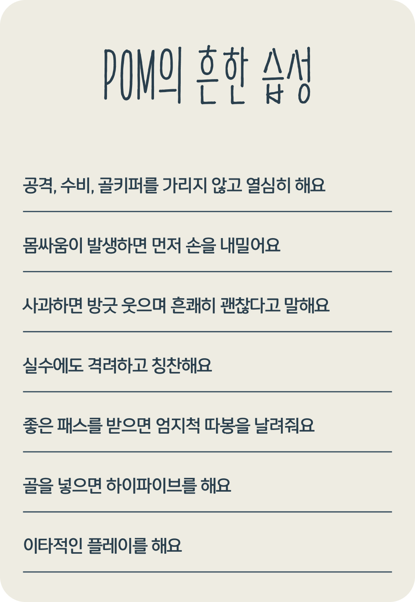
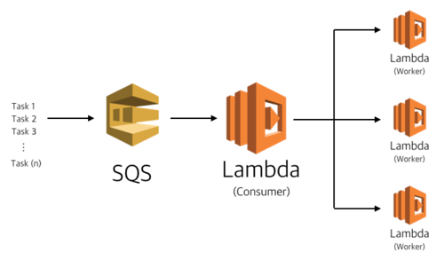

# Overview

[플랩풋볼](https://www.plabfootball.com)은 여전히 같은 문제 의식을 갖고 있습니다. 날이 갈수록 고객이 늘어나고 우리의 책임은 높아지고 있습니다. 대체재가 없다는 이유로, 계속 구매가 이루어지고 있다는 이유로 고객의 2시간을 불확실하게 해서는 안됩니다. 그동안 우리는 인지했지만 운영의 효율과 확장을 이유로 가장 중요한 고객 가치를 미루어 두었습니다.

# 고객 중심의 서비스로 건강하게 성장하기

고객이 느끼는 서비스의 발전은 사실 크게 달라지지 않았습니다. “플랩은 복불복이야” 라는 이야기는 여전했고, 지금의 성장을 있게 해 준 고객들에게 더 좋은 서비스로 보답하지 못하고 있습니다.

취소되는 매치가 늘어나고 우리는 마케팅이나 프로모션에 기대왔습니다. 우리가 모르는 사이 고객들의 신뢰를 잃거나 서비스의 품질이 제자리에 있었습니다. 이제는 쉽고 재밌는 서비스 속에서 수요가 증가해야 합니다. 이제는 고객 가치가 최우선이라는 인식과 액션이 필요합니다. 우리가 해야할 일은 단순합니다. 더 재밌게 만들어서 고객이 다시 찾게 하고, 자주 찾게 하는 것입니다.

고객 중심의 서비스를 바탕으로 건강하고 탄탄하게 성장해야 합니다.

# 긍정적인 에너지를 만들자

우리는 무엇이 문제인지를 알기 위해 잘못된 점만을 피드백 받고 있습니다. 너무나 쉽게 유저는 매니저에 대한 불편한 감정을, 매니저는 유저에 대한 불편한 감정을 리뷰합니다. 그 속에서 불신이 싹 틉니다. 하지만 우리는 그 안에서도 훈훈한 스토리와 좋은 사람들이 대다수라는 걸 느낄 수 있습니다. 특별히 이야기 하거나 꺼내 놓지 않을 뿐이죠. 이제는 유저가 유저에게, 유저가 매니저에게, 매니저가 유저에게. 긍정적인 피드백을 쉽게 남길 수 있게 됩니다. 긍정적인 에너지로 가득 채워지는 플랩을 만듭니다.

# POM(Plaber Of the Match)

### POM은

긍정적인 말과 적극적인 움직임으로 경기에 활력을 불어넣어주는 사람에게 수여하는 작은 게이미피케이션입니다.
 

### 왜 하지?

플래버들의 긍정적인 면을 강조하고 유도하기 위함입니다.
 

### 선정기준은?

 

### 선정방식은?

- 매니저가 선정합니다. 경기중 선택하거나 매치 리포트를 작성할 때 선택할 수 있습니다.
- 선택한 POM은 매치 리포트를 제출 할 때 최종 확정됩니다.
- 팀과 상관 없이 매치당 2-3명을 선정할 수 있으며 필수는 아닙니다.
- 추후 유저들의 평가가 반영될 수 있습니다.
 

### 셀레브레이션

 

### TODO

- POM은 매니저가 매치 리포트를 작성 할 때 제출됩니다.
- 제출과 동시에 POM에 선정된 플래버에게 알림톡이 발송됩니다.
- 플래버는 매치 페이지와 신청 내역에서 확인할 수 있습니다.
- 내가 선정되지 않았을 경우 매치 페이지에서 확인할 수 있습니다.
- 내가 선정 됐을 경우 신청 내역, 알림톡에서 확인할 수 있습니다.
 

# 개발

### SQS, Lambda를 이용해 POM 알림보내기

플랩매니저는 경기가 마무리되면 '매치리포트'를 작성하게 됩니다. 매치 하나가 종료되었다고 말할 수 있습니다.

1. 매치가 종료되었다는 Task를 SQS에 메시지로 보냅니다.
2. Lambda(Cusumer)는 메시지를 받고, Lambda(Worker)를 실행시킵니다.
3. Lambda(Worker)는 받은 일을 처리합니다.

### API 개발

1. 종료된 매치에는 POM 선정하거나 취소할 수 없음
2. POM을 선정할 수 있는 인원이 제한되어 있음
2. GET, POST, PATCH 기능 구현

- GET: 신청내역에서 POM을 받았는지 확인할 수 있습니다.
- POST: 매니저는 POM을 선정할 수 있습니다.
- PATCH: 매니저는 POM을 취소할 수 있습니다.

# 마치며

- 작은 목표, 잦은 배포
	 스토리도 잘 나눴고, 그 안에서 더 작은 목표로 일했음. 작은 목표, 잦은 배포는 부담을 줄여줌.
- 빠르게 만들어보기의 경험
	 사실 어느정도 정해진 흐름이 있어서 다들 동의하는 부분이 많았을거다. 그래도 첫 경험은 대만족.
- 확실히 재미있고, 긍정적인 에너지가 나온다.
	 바로 반응이 올만한 기능을 만드는 것이 내 적성에 맞는 것 같음.
- 각자 열심히 일하는 모습을 보고, 결과를 확인했을때의 감동?
	 동료가 늦게까지 일하며 만든 애니메이션. 유저들이 공유하고 싶겠다 느꼈다.
