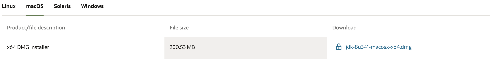
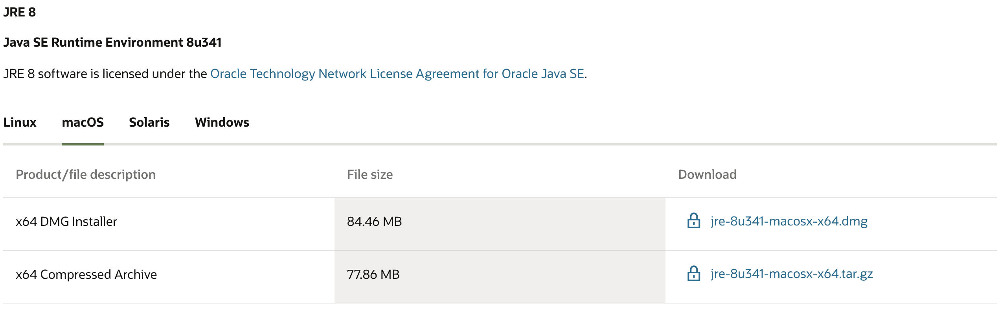
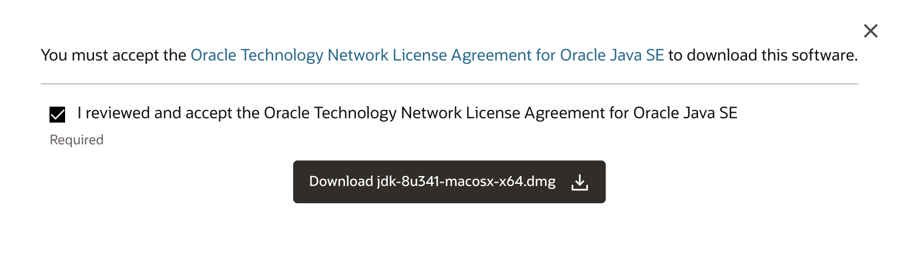
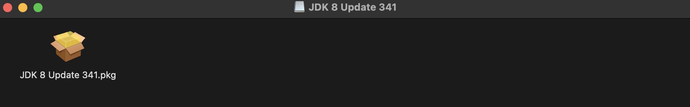

마이클 J.헤르난데즈 - 파워오브데이터베이스(가장 쉬운 데이터 베이스 설계를 위한 지침서)를 읽고 정리해보려 한다.

데이터베이스에 대하여 공부할 때 많은 사람들은 SQL과 특정 DBMS에 대해서만 신경을 쓴다. 데이터베이스 설계는 등한시하는 경향이 있다.

**데이터베이스 설계는 현실세계를 컴퓨터가 인신할 수 있도록 만드는 과정이다.**
현실세계에서 우리가 접하는 것들을 컴퓨터가 인식할 수 있도록 변환하는 과정들을 구체적으로 표현하고 있다.


### 목적
대부분의 데이터베이스 개발 프로세스는 세가지 단계를 거친다.
- 논리적 설계: 테이블과 필드에 대한 정의, 기본키와 외래키의 설정, 테이블간의 관계 설정, 데이터 무결성의 수준
- 물리적 구현: 테이블 생성, 키 필드와 테이블 관계 설정, 데이터 무결성을 구현하기 위한 적절한 도구를 활용
- 응용프로그램 개발: 데이터베이스를 활용할 수 있는 응용프로그램을 만든다. 작업들에 대한 적절한 순서를 결정하는 것, 사용을 위한 체계를 만드는 것


### 학습을 위한 새로운 접근 방법
설계 프로세스에서 사용되는 모든 기술들을 도구라고 생각해보자.
도구들(혹은 기술)은 특정 목적을 충적하기 위해 사용된다.

멍키스패너는 나사를 조이거나 풀 때 사용하는 도구다.
나사가 어디에 있든 상관없이 멍키 스패너는 똑같은 방법으로 사용하여 나사를 조이고 풀 수 있다.

어떠한 설계를 할 때 이런 도구들은 모두 같은 방식으로 사용할 수 있게 될 것이다.

유저 테이블에 주소 필드가 있다.
주소: "72015, 서울시 영등포구 당산동 ..."

주소 필드는 현재 하나 이상의 정보를 담고 있다. 우편 주소, 시군구 등의 정보를 보다 작은 필드로 나누는 것이다.
`Address -> street_address, city, state, zip_code`


### 밑줄
- 논리적인 설계를 잘 해놓으면, 이후 수많은 구조적 변경을 최소화 할 수 있다.
- 데이터베이스 개발자는 논리적 설계와 구현 단계를 구분하여 집중력, 효과성, 효율성을 최대로 보장받아야 한다고 생각한다.


Java를 사용하여 개발을 하기 위해선 [JDK(라이브러리)](https://www.oracle.com/java/technologies/downloads/#java8-mac)와 [JRE(환경)](https://www.oracle.com/java/technologies/downloads/#jre8-macos)를 설치해야 한다.





- **x64 DMG(jdk-8u341-macosx-x64.dmg, jre-8u341-macosx-x64.dmg)** 를 다운로드 합니다.



- 로그인이 필요하다면, 만들어주고 설치하면 됩니다.



- 다운로드가 완료되면, 폴더를 열어 설치를 이어나갑니다.

- 설치를 확인하려면, 아래 명령어를 입력하면 됩니다.
```
java -version
javac -version
```

- 설치된 위치를 확인하려면, 아래 명령어를 입력하면 됩니다.
```
which java
which javac
```

