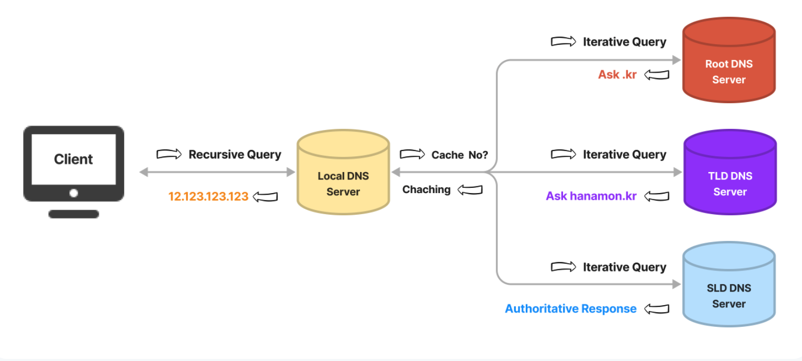
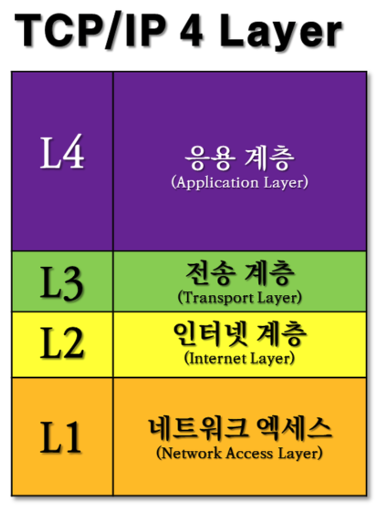
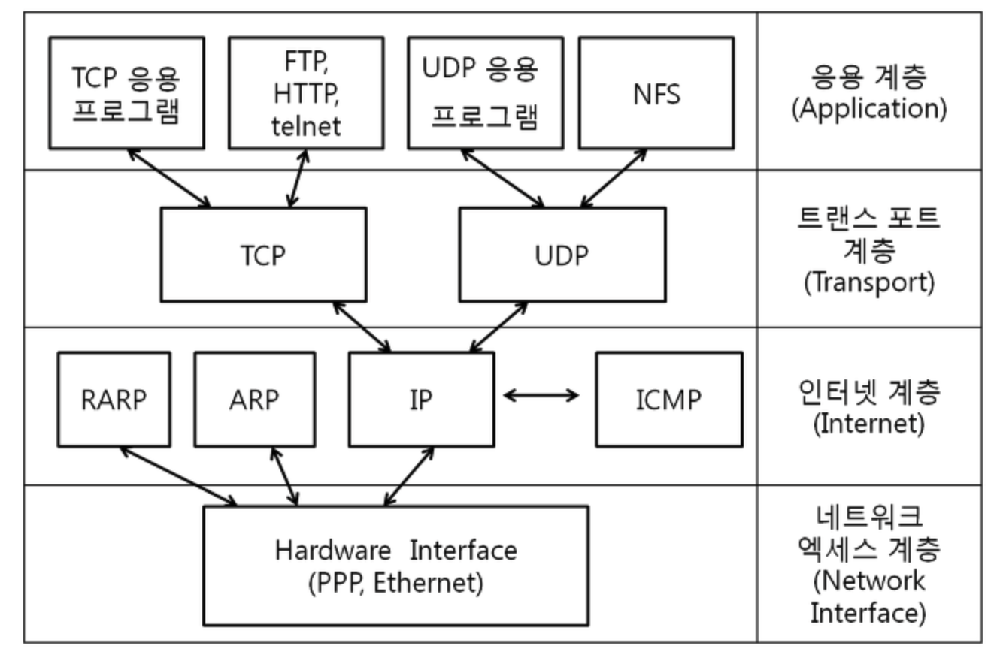

백엔드 개발을 하려면 어떤 지식이 중요하고 무엇을 기본적으로 알아야 할까요? 백엔드 개발 전문가는 어떤 언어, 툴, 주제를 공부하고 개발하나요? 프로젝트 스킬셋을 결정하는데 고려되는 부분들은 어떤 것들이 있나요?

- 웹 서버를 개발하면서 적어도 이렇게 필요하다고 이야기하고 있다.

### TCP/IP
인터넷 표준 프로토콜이라고 불린다.
여러 네트워크를 연결해서 데이터를 주고 받는다.
네트워크에는 '계층'이라는 중요한 개념이 있는데, TCP/IP는 '응용프로그램','전송','네트워크','연결'로 총4계층이 있다.
TCP/IP에서는 물리주소(MAC), 논리주소(IP), 포트주소(Port)가 쓰인다.

### TCP(Transmission Control Protocol)
'전송을 제어하는 프로토콜'으로 신뢰도가 높은 데이터 전송을 가능하게 함.
애플리케이션에서 전송한 데이터를 그 형태로 상대에게 확실히 전달하는 일을 한다.
TCP는 전송계층에 해당하는 프로토콜로 신뢰성을 가진 바이트스트림을 사용한다. 바이트스트림은 커다란 데이터를 보내기 쉽도록 TCP세그먼트라고 하는 단위의 패킷에 작게 나누어 전송한다.

이때 각 패킷에는 번호가 붙기 때문에 누락된 패킷이 있는지 검증할 수 있고, 신뢰도를 담보할 수 있다. 즉 TCP는 큰 데이터를 보내기 쉽도록 작은 단위로 나눈 후, 확실히 상대에게 잘 도착했는지 확인하는 역할을 한다. TCP는 패킷에 플래그를 갖게 되는데, 이를 변경해서 몇 기능을 사용할 수 있다.

### IP(Internet Protocol)
지정한 대상 서버까지 전달받은 데이터를 전하는 일을 한다.
IP는 계층으로 따지면 네트워크 계층에 해당한다. 인터넷 프로토콜이라는 이름에서 알 수 있듯이 인터넷을 활용하는 모든 시스템이 IP를 사용하고 있다. IP의 역할은 각 패킷을 상대에게 전달하는 것이다.

패킷이 상대방에게 전달되기 위해서는 여러 조건들이 필요하다. 그 중에서 각 노드의 위치를 나타내는 IP주소의 역할은 중요하다.
목적지까지 중계를 해주는 도중의 컴퓨터 또는 라우터와 같은 네트워크 장비는 목적지에 도착하기 위한 대략적인 행선지만 알고 있다. 이런 구조를 라우팅이라고 한다.

### HTTP(Hypertext Transfer Protocol)
최상위 계층인 애플리케이션 계층에서 동작한다.
네트워크를 사용해 통신하기 위해서는 서로간 정해진 데이터 형식을 유지해야 한다. HTTP는 서버와 클라이언트가 인터넷 상에서 데이터(동영상, 이미지, 텍스트 등 종류는 상관없다)를 주고받기 위한 프로토콜(protocol)이라고 한다. WWW(World Wide Web)를 구성하는 기술은 HTML, HTTP, URL로 제안되어 있다.

### DNS(Domain Name System)
범국제적 단위로 웹사이트의 IP주소와 도메인 주소를 이어주는 데이터베이스 시스템이다.
도메인은 웹브라우저를 통해 특정 사이트를 진입할 때, IP주소를 대신하여 사용하는 주소이다.
한눈에 파악하기 힘든 IP주소를 보다 분명하게 나타내기 위해 사용된다.
네트워크 상에 존재하는 모든 PC는 IP주소가 있고, 네트워크에는 이것을 위한 서버가 별도로 있다.

### 캡슐화
출발지에서 각 계층을 지날때 반드시 그 계층에 필요한 헤더 정보를 추가한다.
도착지에서 반대로 각 계층을 지날때 사용한 헤더를 제거한다.
이 과정을 '캡슐화'라고 한다.

TCP/IP로 통신할때에는 계층의 순서를 따라 통신을 수행한다. 응용프로그램 계층으로부터 내려가며 출발하여 다시 응용프로그램 계층으로 올라간다.

예를 들면 이렇다.
- 클라이언트가 HTTP(응용프로그램 계층)에서 어떤 웹 페이지를 보기위해 HTTP 요청(GET)을 지시한다.
- TCP(전송 계층)에서는 받은 데이터를 통신하기 좋은 크기로 만든 후, 번호와 포트를 부여하고, IP(네트워크 계층)으로 전달한다.
- IP(네트워크 계층)에서는 전송할 곳의 IP 주소를 추가하고, 연결 계층으로 전달한다.
- 도착지인 서버는 연결계층에서 데이터를 받아, 상위계층으로 전달해 응용프로그램 계층까지 전달한다.
- 응용프로그램 계층에 다시 도착하면 비로소 클라이언트가 보낸 HTTP 요청 내용을 받을 수 있다.

