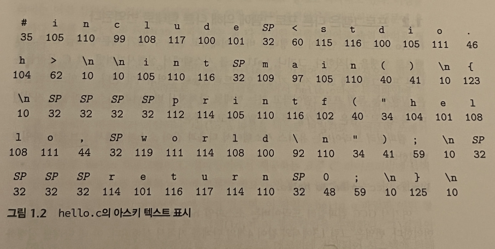
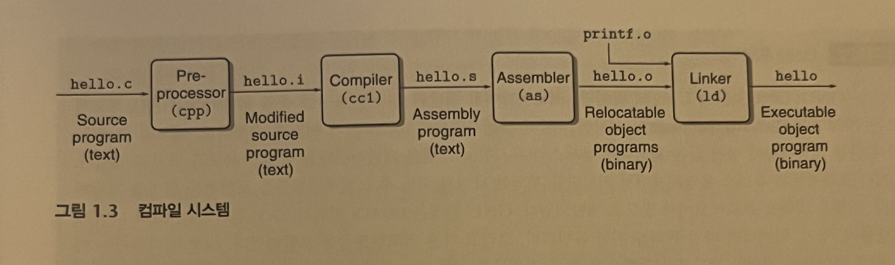
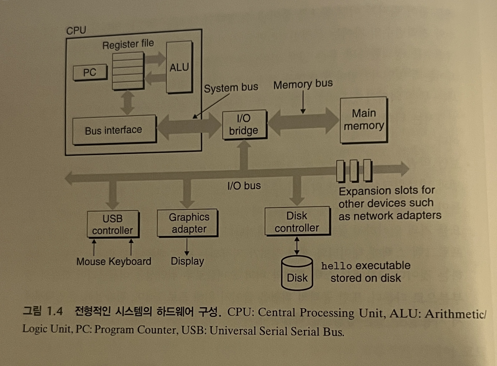

## 1장. 컴퓨터 시스템으로의 여행

<br />
컴퓨터는 '하드웨어'와 '소프트웨어'로 구분한다. 이들은 함께 작동해 '응용프로그램'을 실행한다.
모든 컴퓨터시스템은 유사한 기능을 수행하는 유사 하드웨어와 소프트웨어 컴포넌트를 가지고 있다.
시스템의 구현방법은 달라져도, 근본적인 개념은 변하지 않는다.

1장에서는 'hello'를 출력하는 프로그램을 만든다.
프로그래머로부터 만들어지고, 실행되고, 메시지를 출력하고, 종료될 때까지의 수명주기를 추적하면서 주요 개념과 용어, 그리고 관련된 구성요소를 소개한다.


```c
#include <stdio.h>

int main() {
  printf("hello, world\n");
  return 0;
}
```

이 프로그램은 0과 1로 표시되는 비트의 연속이며, 바이트라는 9비트 단위로 구성된다. 각 바이트는 프로그램의 텍스트 문자를 나타낸다.
작성한 `hello.c` 프로그램은 연속된 바이트들로 파일에 저장된다. 그림과 같이 바이트 35는 '#'와 대응한다.


인간이 읽을 수 있는 `hello.c`는 고급C프로그램이다. 하지만 시스템에서 실행시키려면 저급 기계어 인스트럭션들로 번역되어야 한다.
<br /><br />

```c
linux> gcc -o hello hello.c
# GCC 컴파일러 드라이버는 소스파일인 'hello.c'를 읽어 실행파일인 hello로 번역한다.
```

명령어를 입력하면 네 단계의 프로그램(전처리기, 컴파일라, 어셈블러, 링커)를 거친다. 이를 컴파일 시스템이라고 한다.
컴파일 시스템이 어떻게 동작하는지 이해하는 것은 중요하다. 이러한 질문들에 대한 답을 찾을 수 있을 것이다.
<br />

프로그램 성능 최적화하기
>
- switch문의 if-else문을 연속해서 사용하는 것보다 언제나 더 효율적일까?
- 함수 호출 시 발생하는 오버헤드는 얼마나 되는가?
- while 루프는 for 루프보다 효율적인가?
- 포인터 참조가 배열 인덱스보다 더 효율적인가?
- 합계를 지역변수에 저장하면 참조형태로 넘겨받은 인자를 사용하는 것보다 왜 루프가 더 빨리 실행되는가?
- 수식 연산시 괄호를 단순히 재배치하기만 해도 함수가 더 빨리 실행되는 이유는 무엇인가?

<br />

링크 에러 이해하기
>
- 링커가 어떤 참조를 풀어낼 수 없다고 할 때는 무엇을 의미하는가?
- 정적변수와 전역변수의 차이는 무엇인가?
- 각기 다른 파일에 동인한 이름의 두개의 전역변수를 정의한다면 무슨 일이 일어나는가?
- 정적 라이브러리와 동적 라이브러리의 차이는 무엇인가?
- 컴파일 명령을 쉘에서 입력할 때 명령어 라인의 라이브러리들의 순서는 무슨 의미가 있는가?
- 왜 링커가 관련된 에러들은 실행하기 전까지 나타나지 않는걸까?

<br />

보안 약점 피하기
>
- 안전한 프로그래밍을 배우는 첫 단계는 프로그램 스택에 데이터와 제어 정보가 저장되는 방식 때문에 생겨나는 영향을 이해하는 것이다.

<br />

**프로세서는 메모리에 저장된 인스트럭션을 읽고 해석한다.**
`hello.c`프로그램은 컴파일 시스템에 의해 `hello`라는 실행가능 목적파일로 번역되어 디스크에 저장되었다. 이 실행파일을 유닉스 시스템에서 실행하기 위해서 `shell`이라는 응용프로그램에 그 이름을 입력한다.

```c
linux> ./hello
hello, world
linux>
```
<br />




