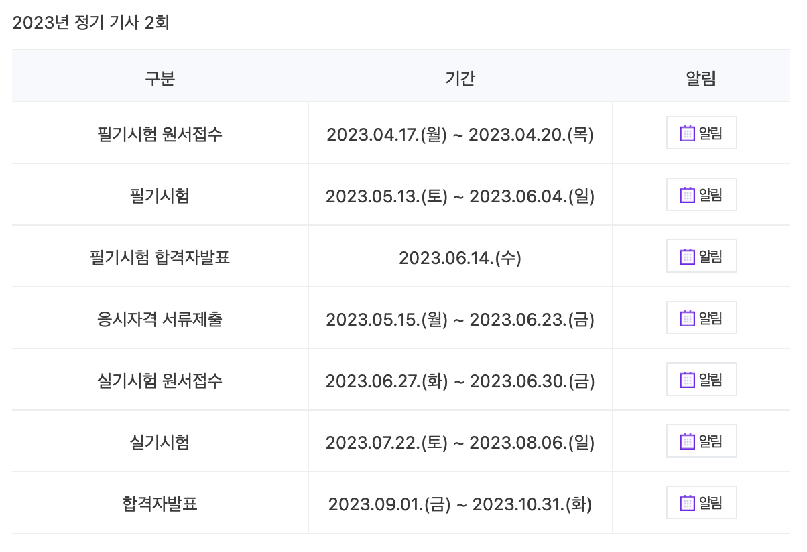

	

### 재료가 없다.

>
"정보처리기사 자격증 취득해야 할까요?"
"필요는 없는데 알고는 있어야죠."

그렇다. 실무로 처음 개발을 배운터라 CS의 기초가 매우 부족하다.
'알고는 있어야죠'가 나에겐 없다.

맛있는 요리를 만드려면 어떤 것이 필요할까? 광이 나는 도구들, 유명 쉐프의 레시피, 다양한 향신료... 여러가지 요소가 있겠지만, 가장 중요한 것은 '건강한 재료' 아니겠나.
이어서, 좋은 코드를 쓸 때에도 '건강한 재료'가 필요하다. 나머지는 부수적이다.

실무에서 어깨너머로 본 얄팍한 상식으로 일을 지속하다보면 판단의 어려움을 겪는다.
프로젝트의 크기가 점점 커질수록 효율에 대한 부분을 걱정하지 않을 수 없다. 최소한의 기본기가 없으면 흔들리고만다.

아무도 모르게 (이 글을 읽고 있는 당신을 제외한) 작은 도전을 하려고 한다. 올해 정보처리기사를 취득할거다.

정보처리기사 시험일정

	

### 피버타임.

필기 시험까지는 약 2달이 남았다. 나는 출근 전 1시간을 여기에 할애하려고 한다.
학습계획은 이렇다.

<ul>
	<li>
		<a href="https://m.blog.naver.com/wook2124/222102990691">2023 정보처리기사 총정리</a> 블로그 1회독
	</li>
	<li>
		<a href="https://www.comcbt.com/">CBT 무료 기출 문제 사이트</a> 해설 맥락 파악
	</li>
	<li>
		블로그 2회독
	</li>
	<li>
		기출 문제 무한 반복
	</li>
</ul>

	

---
 

## 1과목: 소프트웨어 설계

 

### 소프트웨어 생명주기

**폭포수 모형**
>- 가장 오래되고 폭넓게 사용된 고전적인 생명주기 모형
- 한 단계가 끝나야 다음 단계로 넘어가는 선형 순차적 모형
- 단계별 정의 및 산출물이 명확
- 개발 중간에 요구사항 변경은 용이롭지 못함
- 타당성 검토 > 계획 > 요구 분석 > 설계 > 구현 > 테스트 > 유지보수

 

**프로토타입 모형**
>- 견본품을 만들어 최종 결과물을 예측
- 인터페이스 중점 개발
- 개발 중간 요구사항 변경 용이

 

**나선형 모형**
>- 폭포수 모형과 프로토타입 모형의 장점에 위험 분석 기능을 추가한 모형
- 점진적 개발 과정 반복으로 요구사항 추가 가능
- 정밀하고 유지보수 과정 필요 없음
- 계획 및 정의 > 위험 분석 > 공학적 개발 > 고객 평가

 

**애자일 모형**
>- 애자일은 민첩함, 기민함을 의미
- 변화에 유연한 대처
- 일정한 주기를 반복하면서 개발 진행
- 절차와 도구보다 고객과의 소통에 초점
- 기능 중심의 개발
- XP(eXtreme Programing), 스크럼(Scrum), 칸반(Kansan), 크리스탈(Crystal), 린(LEAN)

 

---

### 스크럼

>- 팀원 스스로가 스크럼 팀을 구성
- 개발 작업 관한 모든 것 스스로 해결
- 스프린트 2-4주 정도의 기간으로 진행

 

**제품 책임자, PO(Product Owner)**
>- 요구사항이 담긴 백로그(BackLog)를 작성하는 주체
- 백로그에 대한 우선순위 지정, 이해관계자들의 의견을 종합

 

**스크럼 마스터, SM(Scrum Master)**
>- 일일 스크럼 회의 주관
- 팀원들을 통제하는 것이 목표가 아님

 

**개발팀, DT(Development Team)**
>- 제품 책임자와 스크럼 마스터를 제외한 모든 팀원
- 최대 인원 7-8명

 

**스크럼 개발 프로세스**
>- 계획 회의 > 스프린트 > 일일 스크럼 > 스크럼 검토 회의 > 회고

 

---

### XP(eXtreme Programing)

**핵심 가치**
>- 용기
- 단순성
- 의사소통
- 피드백
- 존중

 

**XP의 기본 원리**
>- Whole Team(전체 팀)
- Small Releases(소규모 릴리즈)
- Test-Driven Development(테스트 주도 개발)
- Continuous Intergration(지속적 통합)
- Collective Ownership(공동 소유권)
- Pair Programing(짝 프로그래밍)
- Design Improvement(디자인 개선) 또는 Refactoring(리팩토링)

 

---

### 개발 기술 환경 파악

**운영체제, OS(Operating System)**
>- 소프트웨어: Windows, Unix, Linux, Mac OS, iOS, Android …
- 가용성, 성능, 기술 지원, 구축비용, 주변 기기

 

**미들웨어(Middleware)**
>- 운영체제(OS)와 응용프로그램 사이에서 추가적인 서비스를 제공하는 소프트웨어

 

**데이터베이스 관리 시스템, DBMS(Database Management System)**
>- 사용자와 데이터베이스(DB) 사이에서 정보를 생성하고 DB를 관리하는 소프트웨어
- DB의 구성, 접근방법, 유지관리에 대한 모든 책임을 짐
- JDBC(Java Database Connectivity, 자바), ODBC(Open Database Connectivity, 응용프로그램)
- Oracle, MySQL, SQLite, MongoDB, Redis …
- 가용성, 성능, 기술지원, 구축비용, 상호 호환성

 

**웹 어플리케이션 서버, WAS(Web Application Server)**
>- 정적인 콘텐츠를 처리하는 웹 서버와 반대
- 동적인 콘첸츠를 처리하기 위해 사용되는 미들웨어(=소프트웨어)
- 데이터 접근, 세션 관리, 트랜잭션 관리 등을 위한 라이브러리 제공
- Tomcat, JEUS, WebLogic, JBoss, Jetty, Resin …
- 가용성, 성능, 기술지원, 구축비용

 

**오픈소스(Open Source)**
>- 누구나 제한 없이 사용할 수 있도록 소스를 무료로 사용할 수 있게 공개한 것
- 라이선스 종류, 사용자 수, 지속가능성

 

---

### 요구사항 정의

**기능 요구사항**
>- 기능 입력, 출력, 저장, 수행 …

 

**비기능 요구사항**
>- 성능, 품질, 제약사항, 호환성, 보안 …

 

**요구사항 개발 프로세스**
>도출(Elicitation), 추출 > 분석(Analysis) > 명세(Specification) > 확인(Validation), 검증(Valification)

 

**요구사항 분석기법**
>- 요구사항 분류
- 개념 모델링(UML)
- 요구사항 할당
- 요구사항 협상
- 정형 분석

 

**요구사항 확인 기법**
>- 요구사항 검토
- 프로토타이핑
- 모델 검증
- 인수 테스트(알파 테스트, 베타 테스트)

 

---

### UML(Unified Modeling Language)

**구성요소**
>- 사물
- 관계
- 다이어그램

 

**사물(Things)**
>- 구조
- 행동
- 그룹
- 주해({사물})

 

**관계(Relationship)**
>- 연관(-)
- 집합(◇)
- 포함(◆)
- 일반화(-▷)
- 의존(- ->)
- 실체화(- -▷){관계}

 

**구조적, 정적 다이어그램(Diagram)**
>- 클래스(Class)
- 객체(Object)
- 컴포넌트(Component)
- 배치(Deployment)
- 복합체 구조(Composite Structure)
- 패키지(Package) {다이어그램(Diagram)}
- 컴포넌트 다이어그램, 배치 다이어그램은 구현 단계에서 사용되는 다이어그램

 

**행위, 동적 다이어그램**
>- 유스케이스(Use Case, 사용사례)
- 시퀀스(Sequence, 순차)
- 커뮤니케이션(Communication, 협업)
- 상태(state)
- 활동(Activity)
- 상호작용(Interaction Overview)
- 타이밍(Timing) {다이어그램(Diagram)}

 

---

### UI(User Interface)

**UI의 구분**
>- CLI(Command Line Interface): 텍스트 형태로 이뤄진 인터페이스
- GUI(Graphical User Interface): 마우스로 선택해 작업을 하는 그래픽 환경의 인터페이스
- NUI(Natural User Interface): 사용자의 말이나 행동으로 기기를 조작하는 인터페이스
- VUI(Voice User Interface): 사람의 음성으로 기기를 조작하는 인터페이스
- OUI(Organic User Interface): 모든 사물과 사용자간의 상호작용을 위한 인터페이스

 

**UI의 기본원칙**
>- 직관성: 누구나 쉽게 이해하고 사용할 수 있어야 함
- 유효성: 사용자의 목적을 정확하고 완벽하게 달성해야함
- 학습성: 누구나 쉽게 배우고 익힐 수 있어야 함
- 유연성: 사용자의 요구사항을 최대한 수용하고 실수를 최소화 해야함

 

**웹의 3요소**
>- 웹 표준(Web Standards)
- 웹 접근성(Web Accessibility)
- 웹 호환성(Cross Browsing)

 

**UI 설계도구**
>- 와이어프레임(Wireframe):  레이아웃을 협의하거나 공유하기 위해 사용
- 스토리보드(Story Board): 최종적으로 참고하는 작업 지침서, 작업 산출물(디스크립션)
- 프로토타입(Prototype): 인터랙션을 적용해 실제 구현된 것처럼 테스트가 가능한 동적인 모형
- 목업(Mockup): 실제 화면과 유사한 정적인 모형
- 유스케이스(Use Case): 사용자 측면 요구사항을 다이어 그램 형식으로 묘사(유스케이스 명세서)

 

**UI 프로토타입**
>- 장점: 사용자를 설득하고 이해시키기 쉬움, 개발시간을 줄일 수 있음, 사전 오류 발견 가능
- 단점: 반복적인 개선 및 보완 작업으로 인한 작업 시간 증가 및 자원 소모, 부분적인 프로토타이핑으로 인한 중요한 작업 생략 가능성
- 예: 페이퍼 프로토타입, 디지털 프로토타입, HTML/CSS

 

**UI 시나리오 문서 요건**
>- 이해성(Understandable): 누구나 쉽게 이해할 수 있도록 설명
- 완전성(Complete): 최대한 상세하게 기술
- 일관성(Consistent): 일관성 유지
- 가독성(Readable): 표준화된 템플릿 등을 활용하여 문서를 쉽게 읽을 수 있도록 해야함
- 수정 용이성(Modifiable): 수정 및 개선이 쉬워야 함
- 추적 용이성(Traceable): 변경사항에 대해 쉽게 추적할 수 있어야 함

 

**기타**
>- HCI(Human Computer Interaction or Interface): 사람과 컴퓨터의 상호작용을 연구해서 사람이 컴퓨터를 편리하게 사용하도록 만드는 학문
- UX(User Experience): 사용자가 시스템이나 서비스를 이용하면서 느끼고 생가하는 총체적인 경험, 주관성(Subjectivity), 정황성(Contextually), 총체성(Holistic)
- 감성 공학: 1류; 인간의 감성, 2류; 심리적 기능, 3류; 공학적 및 수학적 모델, 객관적

 

---

### 품질 요구사항

**국제 제품 품질 표준**
>- ISO/IEC 9126
- ISO/IEC 12119
- ISO/IEC 14598
- ISO/IEC 25000: SW 품질 평가 통합 모델, SQuaRE로도 불리며 위 3개 표준을 통합
- 품질 관리(2500n), 품질 모델(2501n), 품질 측정(2502n), 품질 요구(2503n), 품질 평가(2504n)

 

**ISO/IEC 9126**
>- 기능성(Functionality): 요구사항을 정확하게 만족하는 기능을 제공하는가?
- 적절성(적합성), 정확성, 상호운용성, 보안성, 호환성
- 신뢰성(Reliability): 요구된 기능을 정확하고 일관되고 오류없이 수행하는가?
- 성숙성, 결합허용성, 회복성
- 사용성(Usability): 사용자가 정확하게 이해하고 사용하는가?
- 이해성, 학습성, 운용성, 친밀성
- 효율성(Effcienct): 할당된 시간동안 한정된 자원으로 얼마나 빨리 처리하는가?
- 시간효율성, 자원효율성
- 유지보수성(maintainability): 환경의 변화에 소프트웨어를 쉽게 개선, 확장, 수정할 수 있는가?
- 분석성, 변경성, 안정성, 시험성
- 이식성(Portability): 소프트웨어를 다른 환경에서도 쉽게 적용할 수 있는가?
- 적용성, 설치성 대체성, 공존성

 

**ISO/IEC 14598**
>- 반복성(Repeatability)
- 재현성(Reproducibility)
- 공정성(Impartiality)
- 객관성(Objectivity)

 

**국제 프로세스 품질표준**
>- ISO/IEC 9001
- ISO/IEC 12207: 기본 프로세스, 조직 프로세스, 지원프로세스
- ISO/IEC 15504(SPICE): 분완전 > 수행 > 관리 > 확립 > 예측 > 최적화
- CMMI(Capability Maturity Model Intergration): 조직차원의 성숙도를 평가하는 단계별 표현과 프로세스 영역별 능력도를 평가하는 연속적 표현이 있음

 

---

