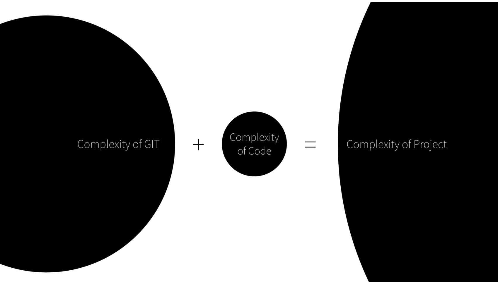
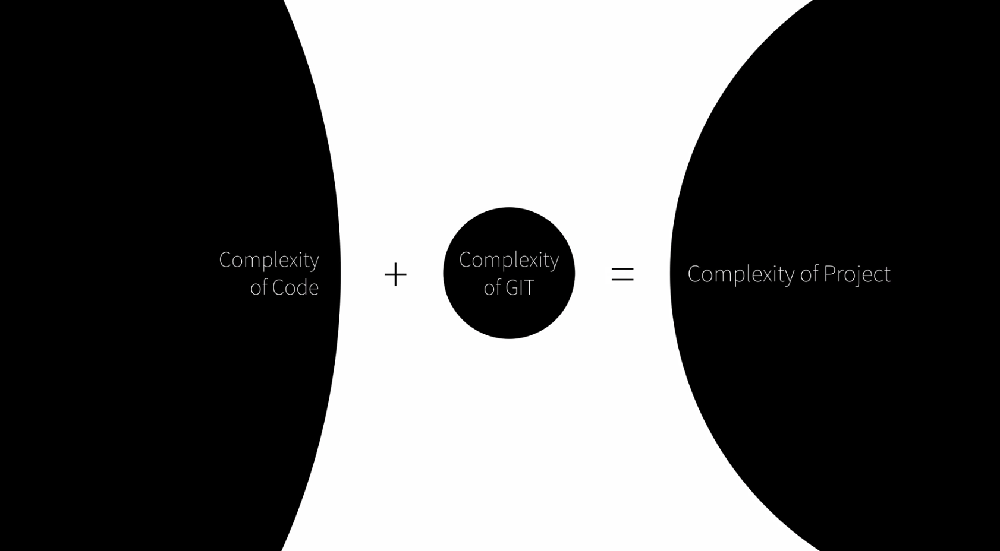

Git은 버전 관리 시스템 입니다.
우리는 의식적으로 버전관리시스템을 생활속에서 접해왔습니다.
우리는 드롭박스나 구글 드라이브로 내 작업물을 저장하고, 최신화하고, 사람들과 같이 협업하고 있었습니다.
파일의 이름을 바꾸면서 최신화하는 과정에서 우리는 이미 버전관리시스템을 쓰고 있었습니다.

```
파일.xls
파일_최종.xls
파일_최종_최종.xls
...
```

- Git을 사용하면 이름을 바꾸지 않으면서 버전관리를 더욱 체계적으로 관리할 수 있게 됩니다.
- BackUp(만약의 상황을 대비한 백업), Recovery(언제든 원하는 상황으로 돌아갈 수 있는 리커버리), Collaboration(다른 사람들과 협업할 수 있는 컬라보레이션)
- 버전 컨트롤 시스템에는 CVS, SVN, GIT이 있다.


<br>

## 어려운 깃을 개발자들은 왜 쓸까?

우리의 현실은 현실보다 더 지옥같기 때문이다.
심플한 초기의 코드는 깃의 복잡한 버전관리가 오히려 더 작업을 힘들게 만들 수 있습니다.
하지만 작업물이 점점 커지고 복잡해져서 깃의 복잡함을 넘어가고서 부터는 힘든 작업을 잘 관리할 수 있도록 도울 수 있습니다.


- 심플한 코드가 깃의 복잡함을 만나면 오히려 힘들 수도 있다.


<br>


- 하지만 복잡한 코드가 깃의 복잡함을 넘어가고서 부터는 힘든 작업을 잘 정리하고 협업할 수 있게 돕는다.


<br>

## git init

작업을 시작할 때에는 두 가지의 명령어를 쓴다.
```
git clone: 리포지토리를 새 디렉터리로 복제한다.
git init: 빈 Git 저장소를 생성하거나 기존 저장소를 다시 초기화합니다.
```

```
>>> git init
>>> Initialized empty Git repository in /Users/googie/Desktop/git-from-the-hell/.git/

>>> ls -al
>>> total 0
drwxr-xr-x   3 googie  staff   96  9 19 07:22 .
drwx------@ 17 googie  staff  544  9 19 07:17 ..
drwxr-xr-x   9 googie  staff  288  9 19 07:22 .git

--- git-from-the-hell
 |_ .git

```


<br>

## git status, git add

```
>>> vim f1.txt
>>> ls
>>> f1.txt

--- git-from-the-hell
 |- .git
 |_ f1.txt

>>> git status
>>> On branch master

No commits yet

Untracked files:
  (use "git add <file>..." to include in what will be committed)

	f1.txt

nothing added to commit but untracked files present (use "git add" to track)


>>> git add
>>> On branch master

No commits yet

Changes to be committed:
  (use "git rm --cached <file>..." to unstage)

	new file:   f1.txt
```

- 파일을 하나 생성합니다.
- `git status`를 입력하면 아직 커밋되지 않았고, 추적되지 않은 파일을 알려줍니다.
- 깃은 아직 버전관리 시스템에 이 문서를 추가하지 않았습니다.
- 버전관리 시스템에 이 문서를 추가하려면 `git add` 명령어를 사용합니다.
- 버전관리에 추가한 파일은 새로운 파일로 인식합니다.


<br>

## git commit, git log
버전은 의미있는 변화를 의미합니다.
누군가 작업하다가 불러서 나가기 전에 저장하는 행위는 버전이 아니고, 무언가의 프로젝트를 완료했을때 버전을 완료했다라고 합니다.

```
>>> git commit -m "1"
>>>
[master (root-commit) ae4dfc8] 1
 1 file changed, 1 insertion(+)
 create mode 100644 f1.txt

>>> git status
>>> 
On branch master
nothing to commit, working tree clean

>>> git log
>>> 
commit ae4dfc877e5bc7b05019a3ef86c3e4fa79e9e193 (HEAD -> master)
Author: googie94 <googie94@gmail.com>
Date:   Mon Sep 19 07:43:39 2022 +0900
    
    1

>>> vim f1.txt // 소스 변경
>>> git status
>>>
On branch master
Changes not staged for commit:
  (use "git add <file>..." to update what will be committed)
  (use "git checkout -- <file>..." to discard changes in working directory)

	modified:   f1.txt

no changes added to commit (use "git add" and/or "git commit -a")

>>> git add f1.txt
>>> git commit -m "2"
>>> 
[master 0d55fcb] 2
 1 file changed, 1 insertion(+), 1 deletion(-)
>>> git log
>>> 
commit 0d55fcb9ac29544ab31595695962e974ad2bd255 (HEAD -> master)
Author: googie94 <googie@gmail.com>
Date:   Mon Sep 19 07:51:31 2022 +0900

    2

commit ae4dfc877e5bc7b05019a3ef86c3e4fa79e9e193
Author: googie94 <googie@gmail.com>
Date:   Mon Sep 19 07:43:39 2022 +0900

    1


>>> cp f1.txt t2.txt

--- git-from-the-hell
 |- .git
 |- f1.txt
 |_ f2.txt

>>> vim f1.txt // 내용을 "v2"로 변경
>>> vim f2.txt // 내용을 "v2"로 변경
>>> git status
On branch master
Changes not staged for commit:
  (use "git add <file>..." to update what will be committed)
  (use "git checkout -- <file>..." to discard changes in working directory)

	modified:   f1.txt
	modified:   f2.txt

no changes added to commit (use "git add" and/or "git commit -a")

>>> git add f1.txt
On branch master
Changes to be committed:
  (use "git reset HEAD <file>..." to unstage)

	modified:   f1.txt

Changes not staged for commit:
  (use "git add <file>..." to update what will be committed)
  (use "git checkout -- <file>..." to discard changes in working directory)

	modified:   f2.txt

>>> git commit -m "4"
[master 8bb5b38] 4
 1 file changed, 1 insertion(+), 1 deletion(-)

>>> git status
>>>
On branch master
Changes not staged for commit:
  (use "git add <file>..." to update what will be committed)
  (use "git checkout -- <file>..." to discard changes in working directory)

	modified:   f2.txt

no changes added to commit (use "git add" and/or "git commit -a")


```
- 내가 원하는 파일만 버전관리할 수 있다(내가 원하는 파일만 add 하고 commit 할 수 있다).
- `git add` 를 하게 되면, 커밋 대기 상태(스테이징)의 상태로 만든다.
- 


<br>

## git log, git diff

```
>>> git log -p // 버전 간의 파일 변경사항을 알려준다.
>>>
commit 8bb5b380c2eb5ef559d206a5b896a50df716ec13 (HEAD -> master)
Author: googie94 <sportfolio94@gmail.com>
Date:   Mon Sep 19 07:59:17 2022 +0900

    4

diff --git a/f1.txt b/f1.txt
index cff2fdb..8c1384d 100644
--- a/f1.txt
+++ b/f1.txt
@@ -1 +1 @@
- hello world?
+ v2
....


>>> git diff // 현재 작업과 직전 커밋의 변경사항을 알려준다.
>>>
diff --git a/f2.txt b/f2.txt
index cff2fdb..8c1384d 100644
--- a/f2.txt
+++ b/f2.txt
@@ -1 +1 @@
-hello world?
+v2

>>> git diff 8bb5b380c2eb5ef559d206a5b896a50df716ec13..0d55fcb9ac29544ab31595695962e974ad2bd255
>>>
diff --git a/f1.txt b/f1.txt
index 8c1384d..cff2fdb 100644
--- a/f1.txt
+++ b/f1.txt
@@ -1 +1 @@
- v2
+ hello world?
diff --git a/f2.txt b/f2.txt
deleted file mode 100644
index cff2fdb..0000000
--- a/f2.txt
+++ /dev/null // 존재하지 않는다
@@ -1 +0,0 @@
- hello world?


```
- 버전의 차이점을 알 수 있고, 어느 시점인지 알 수 있다.
- 차이점과 변경사항을 알 수 있다.
- 버전 간의 차이를 알고 싶을 때는 `git diff <commitID>..<commitID>` 를 사용한다.


<br>

## git reset, git revert

```
>>> git log
>>>
commit cc3ce9dd3add7360d0cee20bf228b83a6c0b3b91 (HEAD -> master)
Author: googie94 <sportfolio94@gmail.com>
Date:   Mon Sep 19 08:16:19 2022 +0900

    5

commit 8bb5b380c2eb5ef559d206a5b896a50df716ec13
Author: googie94 <sportfolio94@gmail.com>
Date:   Mon Sep 19 07:59:17 2022 +0900

    4

commit bc344bfd91f5175c2a7b45c7fedda03ec81bed06
Author: googie94 <sportfolio94@gmail.com>
Date:   Mon Sep 19 07:54:24 2022 +0900

    3

====
- 5,4 의 커밋을 삭제하고(실제로는 숨겨져 있다), 3의 커밋으로 돌아가고 싶을 때,
가장 쉬운 방법은 'git reset' 이다.
====

>>> git reset <commitID> --hard
>>> git log
>>>
commit bc344bfd91f5175c2a7b45c7fedda03ec81bed06 (HEAD -> master)
Author: googie94 <sportfolio94@gmail.com>
Date:   Mon Sep 19 07:54:24 2022 +0900

    3

commit 0d55fcb9ac29544ab31595695962e974ad2bd255
Author: googie94 <sportfolio94@gmail.com>
Date:   Mon Sep 19 07:51:31 2022 +0900

    2

```
- `git reset` 은 이후 버전을 삭제하고, 해당 커밋으로 돌아가고 싶을때 사용한다.
- `git revert` 는 해당 커밋을 취소하면서, 새로운 버전을 만들어 낼때 사용한다.
- 실제로는 삭제된 것이 아니라 보이지 않을 뿐이다. 필요하다면 복구도 가능하다.


