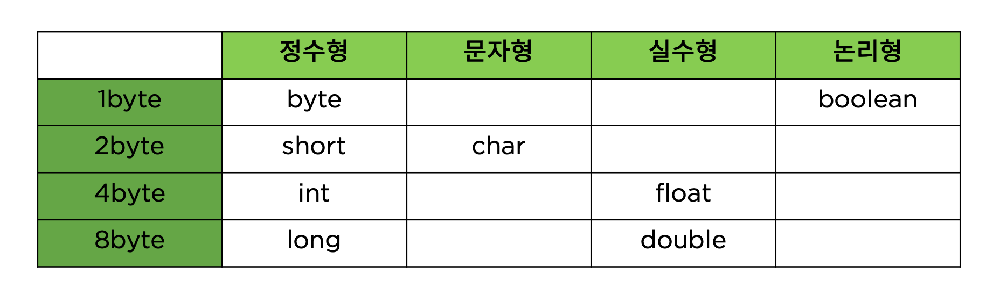
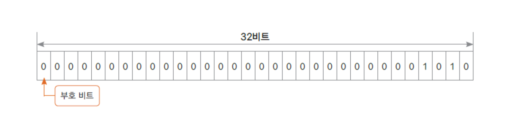
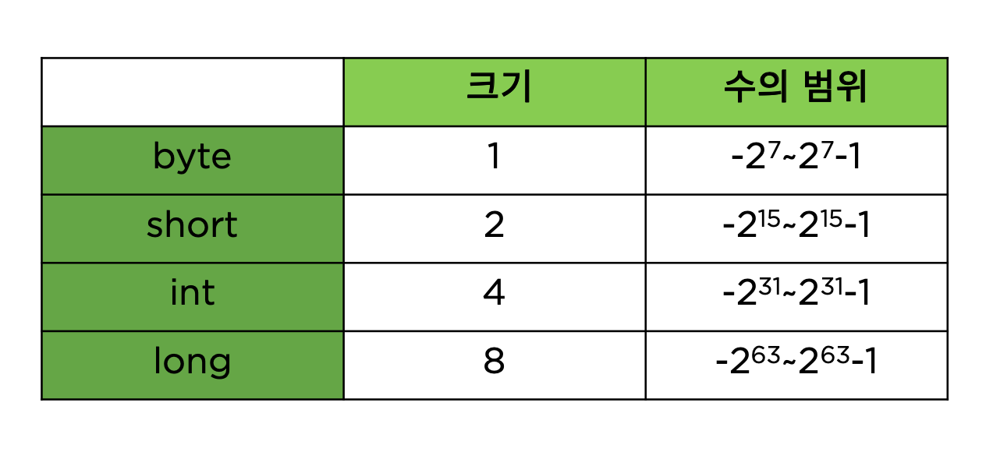

자료형에는 크게 기본형과 참조형 데이터 타입으로 나뉜다.

- 기본형
자바 언어에서 기본적으로 제공해주는 자료형이며, 몇 바이트를 쓸건지가 정해져 있다(정수형, 문자형, 실수형, 논리형)

- 참조형(클래스 자료형)
JDK에서 제공되는 클래스나 프로그래머가 정의하는 클래스
클래스에 따라 사용하는 크기가 다름

### int 자료형
- 정수 자료형
- 4byte 사용
- 가장 많이 쓰이는 정수 자료형
- -2³¹ ~ 2³¹ -1 까지 표현

